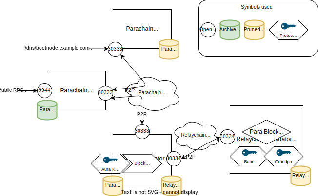

# Blockchain Node Roles

A non exhaustive list of some common roles assumed by nodes:

| Role         | Description                                                                                                                                                                                                                      |
| ------------ | ----------------------------------------------------------------------------------------------------------------------------------------------------------------------------------------------------------------------------- |
| Validator    | Secures the Relay Chain by staking DOT, validating proofs from collators on parachains and voting on consensus along with other validators.                                                                                   |
| Collator     | Maintains a parachain by collecting parachain transactions and producing state transition proofs for the validators.                                                                                                          |
| Bootnode     | A node with a static address and p2p public key, used to bootstrap a node onto the network’s distributed hash table and find peers.                                                                                           |
| RPC Node     | Expose an RPC interface over http or websocket for the relay chain or parachain and allow users to read the blockchain state and submit transactions (extrinsics). There are often multiple RPC nodes behind a load balancer. |

Additionally, we also usually distinguish types of nodes:

| Type         | Description                                                                                                                                                                                                                      |
| ------------ | ----------------------------------------------------------------------------------------------------------------------------------------------------------------------------------------------------------------------------- |
| Full Node    | A node which is syncing the relay chain or parachain to the current best block. It can make use of database pruning to reduce its disk usage.                                                                                                                                              |
| Archive Node | A full node which has a complete database starting all the way from the genesis block.     
| Light Node    | Also called light client, can connect to a chain network but does not require to have full copy of the entire blockchain                                                                                                                                              |

## Simplified Diagram of the Parachain Network architecture

The diagram below illustrate how different nodes play different roles in the network by having different configuration.

- Bootnodes expose their P2P port behind an easy to find IP or DNS address.
- RPC nodes expose their RPC endpoint publicly.
- Collators sign blocks and propose them for validation to the Relaychain validators
- We can adjust the database pruning (archive or pruned) depending on the node role.

## Downsides of deploying nodes without clear role separation

Although, it is possible for a single node to assume multiple roles (collator, RPC, bootnode), robust network deployments are composed of multiple nodes of each types to ensure reliability (eg. several dedicated RPC nodes behind a load balancer can handle increased user traffic, having more collators allows downtime of a single collator without slowing down block production, etc.).
