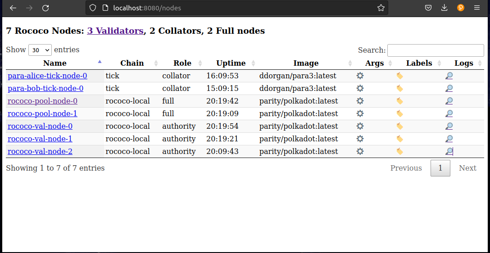
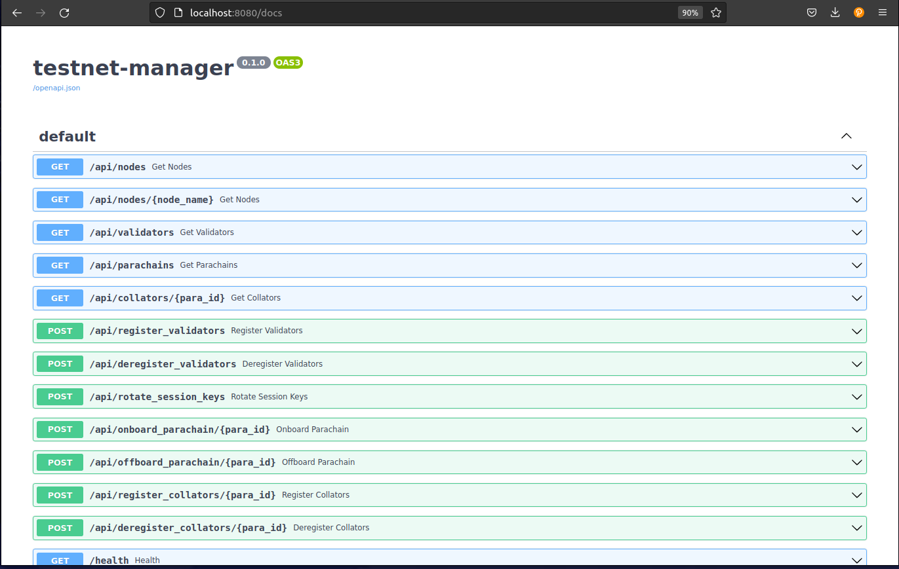

Testnet Manager
==================

The [testnet manager chart](https://github.com/paritytech/helm-charts/tree/main/charts/testnet-manager) eanbles you to dynamically control test networks via a useful frontend GUI or API. It allows you to both view and modify information for nodes, validators and parachains in one place.

### Requirements

The testnet manager requires the seed phrase to the chains to perform management functions. Also some chain specific variables should be defined in a configmap, this can be added to the `values.yaml`:s


```yaml
configmap:
  WS_ENDPOINT: "ws://rococo-alice-node-0.rococo:9944"
  NODE_HTTP_PATTERN: "http://NODE_NAME.rococo:9933"
  NODE_WS_PATTERN: "ws://NODE_NAME.rococo:9944"
  HEALTHY_MIN_PEER_COUNT: "1"
  SUDO_SEED: "0xe5be9a5092b81bca64be81d212e7f2f9eba183bb7a90954f7b76361f6edb5c0a" # Alice
  VALIDATORS_ROOT_SEED: "test test test test test test test test test test test test"
  LOG_LEVEL: DEBUG

  ```

Then install the testnet manager and port forward a connection using the output of the install:

```
helm install testnet-mgr . --values values.yaml
```

### Frontend GUI


In the nodes section you can view all running nodes, their roles, chain, uptime, cli arguments and you can also view logs.


 


### Interact with API via Frontend

It's possible to view the API calls and execute them via the GUI. The main functions are:

* Viewing nodes, validators, collators and parachains
* Registering / de-registering validators and collators
* Onboarding / off-boarding parachains
* Rotating session keys




### Examples

Register a new validator in the `StateFullSet` called `rococo-val-pool`:

```
curl -X 'POST' \
  'http://localhost:8080/api/register_validators?statefulset=rococo-val-pool' \
  -H 'accept: application/json' \
  -d ''
  ```

  Onboard Parachain id 1000:

  ```
  curl -X 'POST' \
  'http://localhost:8080/api/onboard_parachain/1000' \
  -H 'accept: application/json' \
  -d ''
  ```


