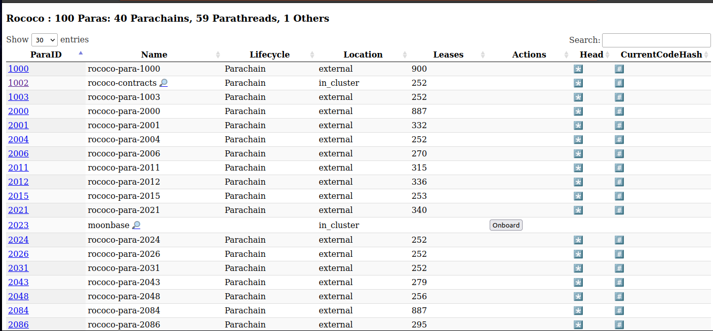
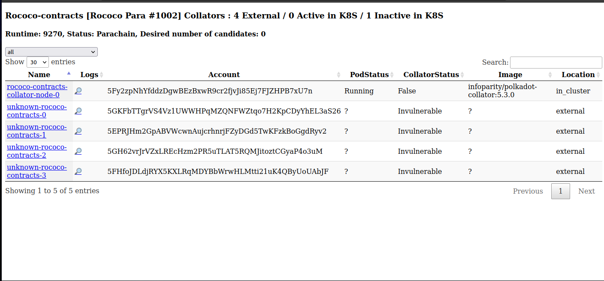
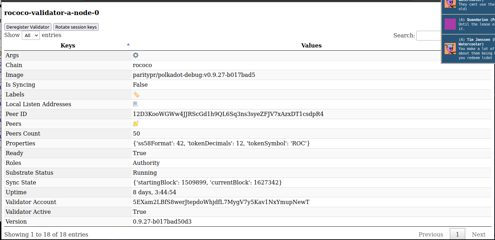

# Testnet Manager

The [Testnet manager](https://github.com/paritytech/testnet-manager) ([helm chart](https://github.com/paritytech/helm-charts/tree/main/charts/testnet-manager)) lets you dynamically control test networks via a simple UI or API. It gives you a single pane of glass to list, inspect and interact with the nodes (full nodes, validators and parachain collators) running in a given Kubernetes namespace.

## Rococo Example View

### List Parachains



### List Parachain Collators



### Inspect Validator Node



## Usage

### Requirements

The testnet manager requires the chain Sudo seed phrase to perform management functions. Also, some chain specific variables should be defined in a configmap, this can be added to the `values.yaml`:

```yaml
configmap:
  WS_ENDPOINT: "ws://rococo-alice-node-0.rococo:9944"
  NODE_HTTP_PATTERN: "http://NODE_NAME.rococo:9933"
  NODE_WS_PATTERN: "ws://NODE_NAME.rococo:9944"
  HEALTHY_MIN_PEER_COUNT: "1"
  LOG_LEVEL: DEBUG

secret:
  SUDO_SEED: "0xe5be9a5092b81bca64be81d212e7f2f9eba183bb7a90954f7b76361f6edb5c0a" # Alice
  VALIDATORS_ROOT_SEED: "test test test test test test test test test test test test"
```

Then install the testnet manager and port forward a connection using the output of `helm install ...`:

```bash
helm repo add parity https://paritytech.github.io/helm-charts/
helm repo update
helm install testnet-mgr parity/testnet-manager --values values.yaml
```

### Frontend GUI

In the nodes section you can view all running nodes, their roles, chain, uptime, CLI arguments, and you can also view logs.


### Interact with API via Frontend

It's possible to view the API calls and execute them via the GUI. The main functions are:

- Viewing nodes, validators, collators and parachains
- Registering / deregistering validators and collators
- Onboarding / off-boarding parachains
- Rotating session keys


### Examples

Register a new validator in the `StatefulSet` called `rococo-val-pool`:

```bash
curl -X 'POST' \
  'http://localhost:8080/api/register_validators?statefulset=rococo-val-pool' \
  -H 'accept: application/json' \
  -d ''
```

Onboard Parachain id 1000:

```bash
curl -X 'POST' \
'http://localhost:8080/api/onboard_parachain/1000' \
-H 'accept: application/json' \
-d ''
```

### How does it work ?

The testnet-manager is deployed in the same Kubernetes namespaces as nodes deployed with the [node helm-chart](https://github.com/paritytech/helm-charts/tree/main/charts/node). As node pods deployed with the chart are tagged with the appropriate labels (e.g. chain name, para ID), the manager is able to query the Kubernetes API and list the running nodes for each network (relay-chain, parachains).

By combining this list of nodes with the on-chain state retrieved from RPC endpoints (e.g. list of active validators accounts), the manager can automate node key setup (by interacting directly with each node RPC endpoint) and registration (by submitting sudo extrinsics). Behind the scenes, it uses a derivation formula for generating deterministic Validator/Collator accounts addresses: "${VALIDATORS_ROOT_SEED}//${node-name}".
