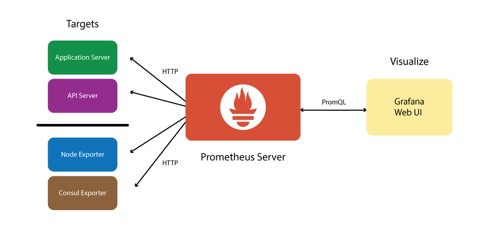

# Example Monitoring Stack

An example of a very common open source monitoring stack. There are various tools for each layer of the stack:

- Prometheus - A time series database which can hold large amounts of data that can be accessed very quickly. It scrapes data from your defined exporters and saves this data.
- Grafana - Grafana allows you to query, visualize, and understand your metrics. Many example dashboards exist and it is easy to create new ones.
- Alertmanager - Creates and routes alerts based on alert rules and metrics. Many provider plugins exist to send alerts via email / sms / telegram / pagerduty / victorops / slack / matrix etc...
- Loki - A highly scalable log aggregation system that allows you to view and search logs from all your infrastruture in one place.
- Exporter - A process that listens on a port and reports appliation specific metrics to prometheus when scraped. Lots of exporters exist and new ones are easy to write. It just requires you return data in the format of: `<key>: <value>' with labels being optional.
