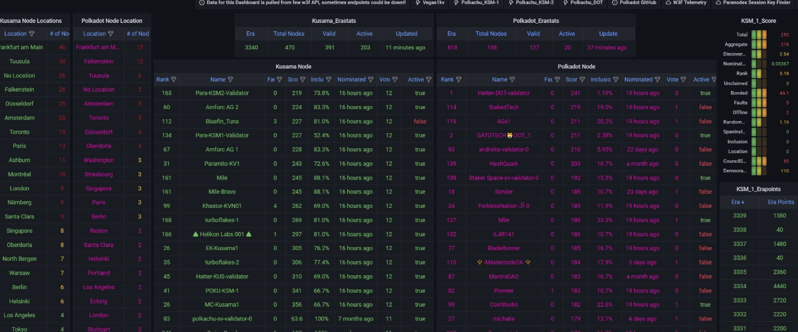

# Grafana

Grafana is where you can define dashboards to show the time series information that Prometheus is collecting. You just need to ensure you add a datasource:

```yaml
datasources:
  - name: "prometheus-prod"
    type: prometheus
    access: proxy
    editable: false
    orgId: 1
    url: "http://prometheus-prod.monitoring.svc.cluster.local"
    version: 1
    jsonData:
      timeInterval: 30s
```

You can find [dashboards](https://github.com/paritytech/polkadot-monitoring-mixin/tree/main/dashboards) here.


