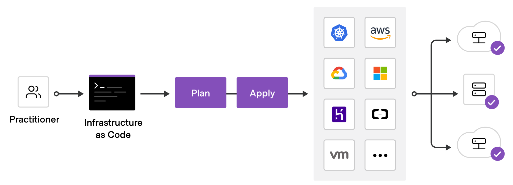
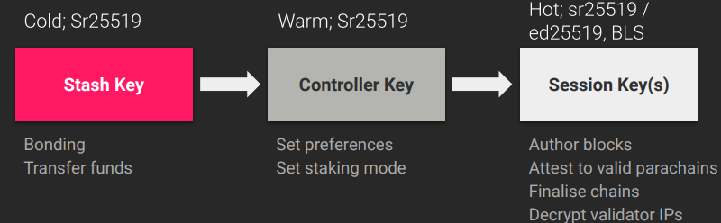

# Overview

This document has been written for two main functions. First to provide a clear overview of the existing setup. The second is to provide some guidance on agreeing the CI strategy moving forward.

## General Approach to Infrastructure

It is highly recommended that projects deploying networks have an infrastructure as code mindset. The infrastructure components in deployments should be written in code and put in a version control system.

This ensures that:

- Your Infrastructure is in a known state
- Version control is available to see changes and enforce reviews etc...
- Rolling back is made very easy
- There are no manual actions required to redeploy

## General Approach to Security

One of the main desired properties of a blockchain is security, so having a very ‘secure by default’ approach to your infrastructure should always be in the forefront of your mind when deploying new networks.

On the infrastructure side, having strict rules and blocking any non-required communication is just a starting point. Other things that should be considered are things like log monitoring, bastion hosts being required for access, 2FA for ssh etc…

On the chain operations side, there are two very useful concepts to increase your security.

First is using cold / warm / hot keys, so that the compromise of say a session key would not lead to any funds being stolen. Also using multisig accounts on offline devices can greatly help security and also give an on-chain audit trail of all actions, allows for alerting for any onchain actions etc...

Proxy accounts also let you limit the permission that an account or multisig account has on a particular target account (e.g. only staking functions can be executed by the staking controller multisig account and require 3 of 5 people to approve).
